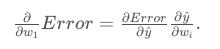
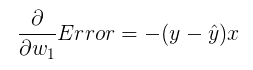

# Development of the derivative of the error function

Notice that we've defined the squared error to be

`Error = (1/2)(y - y_hat)^2`

Also, we've defined the prediction to be

`y_hat = w_1(x) + w_2`

So to calculate the derivative of the Error with respect to `w_1` , we simply use the chain rule:

The first factor of the right hand side is the derivative of the Error with respect to the prediction `y_hat`, which is `-(y − y_hat)`

The second factor is the derivative of the prediction with respect to `w_1`, which is simply `x`.

Therefore, the derivative is

