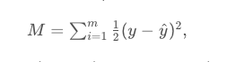
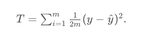

# Mean vs Total Squared (or Absolute) Error

A potential confusion is the following: How do we know if we should use the mean or the total squared (or absolute) error?

The total squared error is the sum of errors at each point, given by the following equation:

whereas the mean squared error is the average of these errors, given by the equation, where `m` is the number of points:

The good news is, it doesn't really matter. As we can see, the total squared error is just a multiple of the mean squared error, since

Therefore, since derivatives are linear functions, the gradient of *`T`*  is also mm times the gradient of `M`.