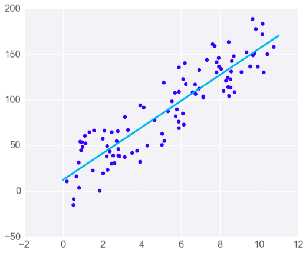
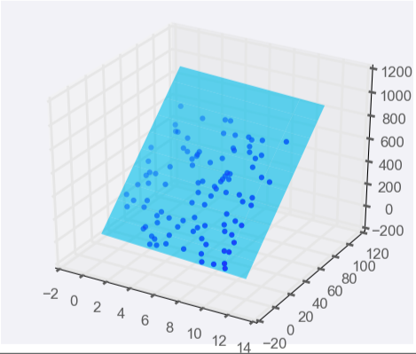

# Multiple Linear Regression

When there's just one predictor, the linear regression model is a line, but as you add more predictor variables, you're adding more dimensions to the picture.

When you have one predictor variable, the equation of the line is

```
y=mx+b
```

and the plot might look something like this:



Adding a predictor variable to go to two predictor variables means that the predicting equation is:

```
y = m_1 x_1 + m_2 x_2 + b
```

To represent this graphically, we'll need a three-dimensional plot, with the linear regression model represented as a plane:



You can use more than two predictor variables - in fact, you should use as many as is useful! If you use nn predictor variables, then the model can be represented by the equation

```
y = m_{1} x_{1} + m_{2} x_{2} + m_{3} x_{3}+ ... +m_{n} x_{n} + b
```
