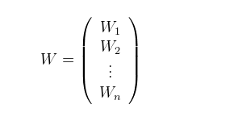

# (Optional) Closed form solution math

## 2-Dimensional solution

Our data will be the values (x1, x2), and our labels will be the values (y1, y2) . Let's call our weights (w1, w2) . Therefore, our predictions are ( y= w1x1 + w2).The mean squared error is:

We can use any method to solve 2 equations and 2 variables. For example, if we multiply the first equation by (∑ (i=1 m) xi ) , the second one by (m) m, subtract them to obtain a value for (w1) , and then replace this value in the first equation, we get the following:

That's our desired solution.

## n-Dimensional solution

Now, let's do this when our data has n dimensions, instead of 2. In order to do this, we'll introduce the following notation. Our matrix (X) containing the data is the following, where each row is one of our datapoints, and (x (0 (i) ) =1) to represent the bias.

Now, to minimize this, we need to take the derivative with respect to all values in the matrix (W). Using the chain rule, as we used above, we get the following:

That's it, that's our closed form solution for (W)!
