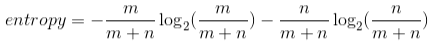
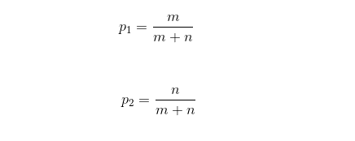
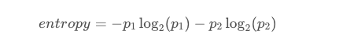

# Multiclass Entropy  🧐

## Multi-class Entropy

Last time, you saw this equation for entropy for a bucket with `m` red balls and `n` blue balls:

We can state this in terms of probabilities instead for the number of red balls as `p1` and the number of blue balls as `p2`:

This entropy equation can be extended to the multi-class case, where we have three or more possible values:

