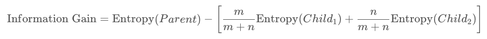

# Solution: Information Gain

## Information Gain Formula
Note that the child groups are weighted equally in this case since they're both the same size, for all splits. In general, the average entropy for the child groups will need to be a weighted average, based on the number of cases in each child group. That is, for mm items in the first child group and nn items in the second child group, the information gain is:

