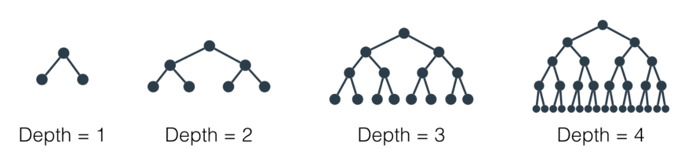
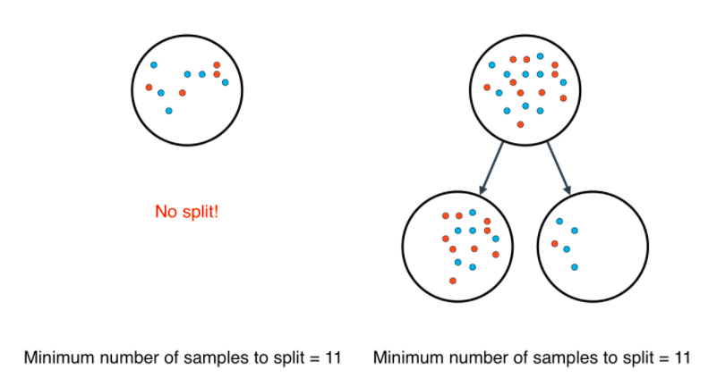

# Hyperparameters

## Hyperparameters for Decision Trees

In order to create decision trees that will generalize to new problems well, we can tune a number of different aspects about the trees. We call the different aspects of a decision tree "hyperparameters". These are some of the most important hyperparameters used in decision trees:

## Maximum Depth

The maximum depth of a decision tree is simply the largest possible length between the root to a leaf. A tree of maximum length `k` can have at most `2^k2` leaves.

## Minimum number of samples to split

A node must have at least `min_samples_split` samples in order to be large enough to split. If a node has fewer samples than `min_samples_split` samples, it will not be split, and the splitting process stops.

However, `min_samples_split` doesn't control the minimum size of leaves. As you can see in the example on the right, above, the parent node had 20 samples, greater than `min_samples_split` = 11, so the node was split. But when the node was split, a child node was created with that had 5 samples, less than `min_samples_split` = 11.
