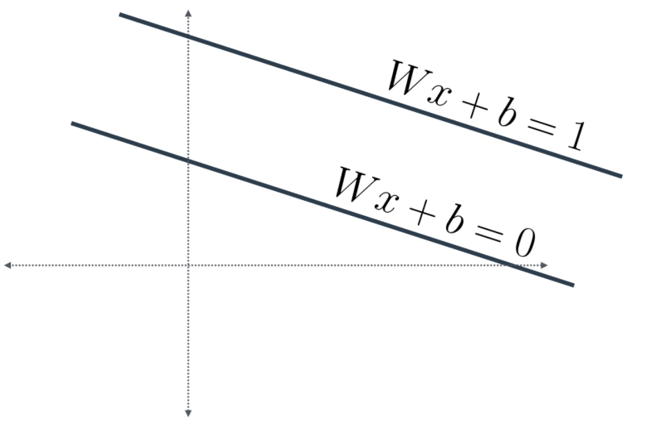
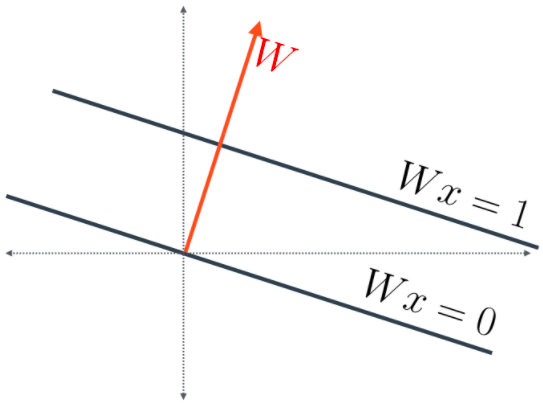
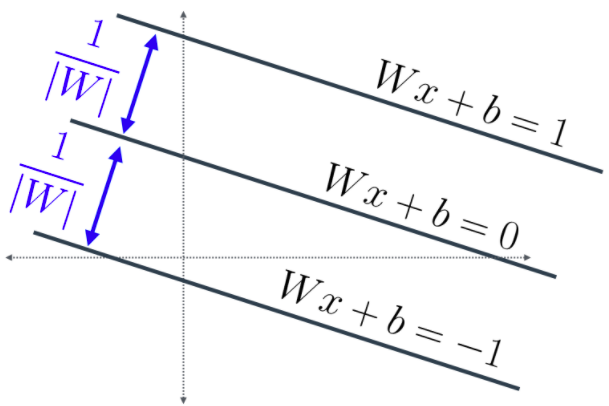

# (Optional) Margin Error Calculation 💻

## (Optional) Margin Error Calculation

In this optional section, we'll calculate the distance between the two margins in the SVM.

First, recall the notation, where Where `W=( w1, w2 )` and `x=( x1 , x2 ),` and `Wx= w1x1 + w2x2`.

Notice that all we have three lines, of the following equations:

- `Wx+b=1`
- `Wx+b=0`
- `Wx+b=-1`

Now, notice that since we're only measuring distances between lines, we might as well translate these two lines, so that one of them touches the origin. Thus, our new equations are:

- `Wx=0`
- `Wx=1`

Now, the first line has equation `Wx=0`, which means it's orthogonal (perpendicular) to the vector `W=( w1, w2 )` ) colored in red.

This vector intersects the line of equation `Wx=1` at the blue point. Let's say the point has coordinates `(p,q)`. Then, we know two things:

- `w1p + w2q =1` (since the point is over the line), and
- `(p,q)` is a multiple of `(w_1, w_2)`, since the point is over the vector `W = (w_1, w_2)`

And finally, we remember that the desired distance was the sum of these two distances between the consecutive parallel lines (Figure 6). Since each one of them is `1/|w|` , then the total distance is `2/|w|`

