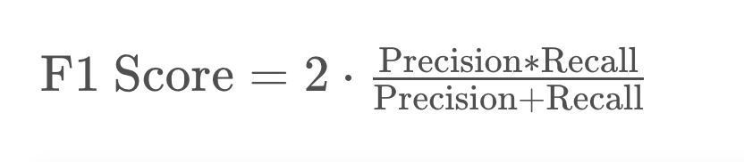

# F1 Score

For the following, remember that the formula for F1 Score is:




## Precision Quiz

If the Precision of the medical model is **55.6%**, and the Recall is *83.3%*, what is the F1 Score? (Please write your answer as a percentage, and round it to 1 decimal point.)

```
66.68
```
