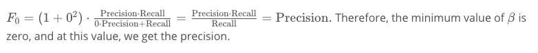
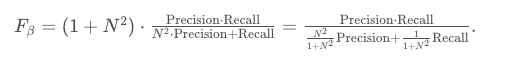
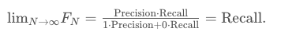
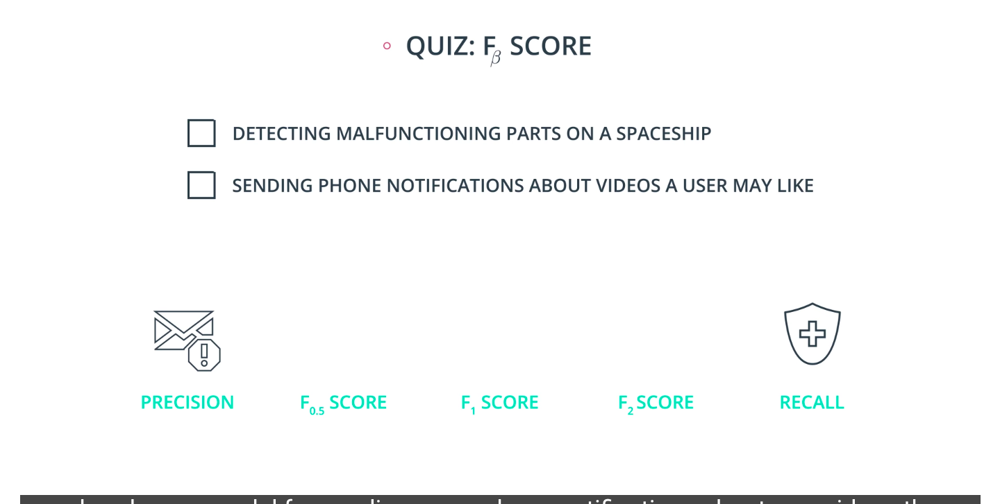

# F-beta Score

Note that in the formula for `Fβ` score, if we set `β=0` we get.

Now, notice that if N is really large, then

As `N` goes to infinity, we can see that `1/1+N^2` goes to zero, and `N^2/1+N^2` goes to 1.

Therefore, if we take the limit, we have

Thus, to conclude, the boundaries of beta are between 0 and ∞.

- If `β=0`, then we get **precision**.
- If `β=∞`, then we get **recall**.
- For other values of `β` if they are close to 0, we get something close to precision, if they are large numbers, then we get something close to recall, and if `β=1` then we get the **harmonic mean** of precision and recall.

